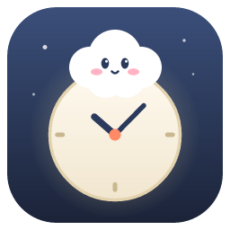
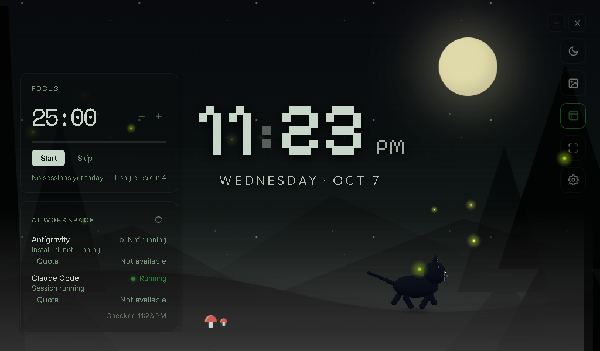
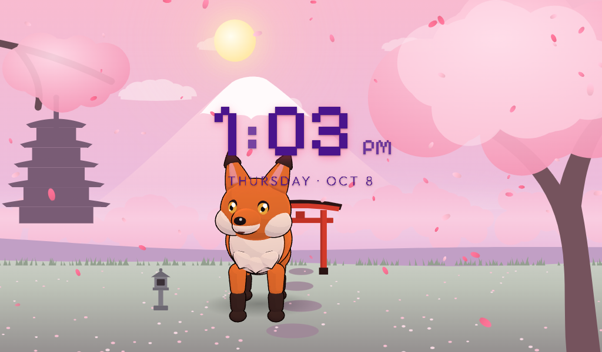
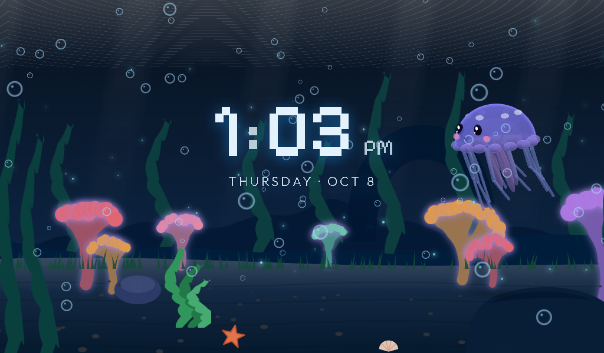
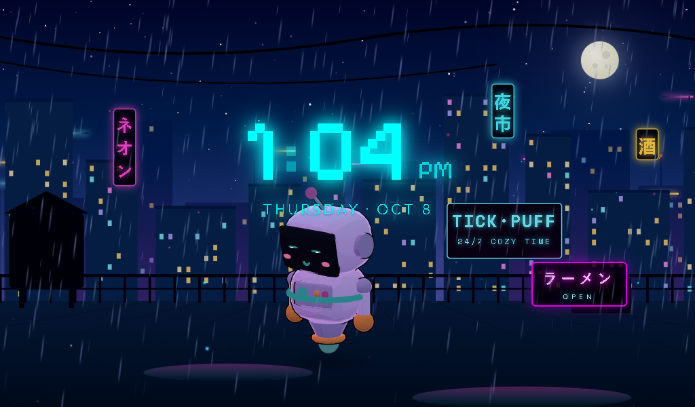
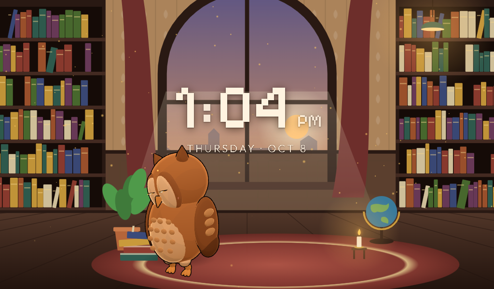

<p align="center">
  
</p>

<h1 align="center">TickPuff</h1>

<p align="center"><strong>A lightweight ambient desktop clock and living companion.</strong></p>

<p align="center">
  <a href="https://apps.microsoft.com/detail/9NCCLZRSL5WV?mode=direct">
    
  </a>
</p>

<p align="center">
  <a href="LICENSE">MIT License</a> ·
  <a href="docs/development.md">Development</a> ·
  <a href="docs/architecture.md">Architecture</a> ·
  <a href="ROADMAP.md">Roadmap</a> ·
  <a href="CHANGELOG.md">Changelog</a>
</p>

TickPuff is a calm desktop clock that lives in a small world. A 3D companion wanders around the scene,
naps, reacts when you pet it and keeps you company while you focus. Productivity and developer tools are
there when you want them and out of the way when you don't.

It is a clock first — not a dashboard, not a productivity suite.



| | |
| --- | --- |
|  |  |
|  |  |

## Features

| | |
| --- | --- |
| **Clock** | Large customizable clock and date: five bundled fonts (or the world's own), size, weight, spacing, colour, seconds, 12/24-hour. |
| **Worlds** | Five themed worlds — Cozy Forest, Sakura Dream, Deep Aquarium, Cyber City, Magic Library — whose colours follow the time of day. Each world remembers its own companion and atmosphere. |
| **3D companion** | A companion that roams the world, visits spots like the pine tree or the candle, sleeps, stretches, plays, looks at your cursor, celebrates finished focus sessions, greets you when you come back and dances to your music. Eleven detailed, cel-shaded companions across the worlds, in three sizes. |
| **Atmosphere** | GPU particle rain, snow, petals, leaves, bubbles, dust, fireflies and sparks, plus soft fog. Optionally follows your real local weather. |
| **Focus** | Pomodoro timer with short and long breaks, custom durations, auto-start, a chime and a daily streak. Timestamp-based, so it never drifts. |
| **Tasks, notes, countdown, calendar, daily summary** | Small local tools, each an independent widget. |
| **AI workspace** *(Windows)* | Shows whether Antigravity (IDE or `agy` CLI) and Claude Code are running or installed. |
| **System monitor** | Real CPU and memory use; GPU utilisation on Windows. |
| **Now playing** *(Windows)* | The current media session from Windows, with play/pause and skip. |
| **Ambient & sleep modes** | Hide everything but the world, or dim it and let the companion sleep. Full screen with <kbd>F11</kbd>. |
| **Calm layout** | Widgets live in drawers that slide in from the edges (<kbd>W</kbd>) and stay out of the way otherwise; a small glance under the clock shows a running focus timer. Every widget can be turned on or off, placed left or right and reordered, and presets switch layouts in one click. |
| **Updates** *(desktop)* | Signed in-app updates from GitHub releases; you choose when to install. |
| **Mini mode & tray** *(desktop)* | A small always-on-top window in the corner with just the clock and companion, a tray menu, and optional start with Windows. |

### Honest status notes

- **Companion models are procedural.** They are built at runtime from code (cel shading, ink outlines,
  detailed faces), not sculpted 3D art. The engine already loads GLB/GLTF models — see
  [docs/companions.md](docs/companions.md).
- **Quota is not shown for AI tools.** Neither Antigravity nor Claude Code provides a supported way for
  other apps to read usage or quota, so TickPuff shows "not available" rather than guessing.
- **Windows is the only tested platform.** See [supported platforms](#supported-platforms).

## Supported platforms

| Platform | Status |
| --- | --- |
| Windows 10/11 (x64) | Primary target, built and tested. |
| macOS, Linux | Not tested. The code is written to compile there, but GPU usage, Now Playing and AI tool install detection report "unavailable" and no builds are published. Contributions welcome. |

## Install

**Recommended: [get TickPuff from the Microsoft Store](https://apps.microsoft.com/detail/9NCCLZRSL5WV).**
It's free, signed by Microsoft (no "unknown publisher" warning) and updates automatically.

You can also download the installer from the [Releases page](https://github.com/WiseHax/TickPuff/releases).
That installer isn't code-signed yet, so Windows SmartScreen may say it protected your PC: click
**More info → Run anyway**.

## Build from source

Requirements:

- [Node.js](https://nodejs.org/) 20.19 or newer
- [Rust](https://rustup.rs/) 1.88 or newer
- The [Tauri prerequisites](https://v2.tauri.app/start/prerequisites/) for your OS
  (on Windows: Microsoft C++ Build Tools and WebView2, which ships with Windows 11)

```bash
git clone https://github.com/WiseHax/TickPuff.git
cd TickPuff
npm install
npm run tauri dev      # run the desktop app with hot reload
npm run tauri build    # build installers into src-tauri/target/release/bundle
```

`npm run dev` also runs the interface in a normal browser at http://localhost:1420 for quick UI work;
desktop-only features (AI detection, system stats, media) show as unavailable there.

Run every check the CI runs:

```bash
npm run verify
```

See [docs/development.md](docs/development.md) for the full workflow, and
[docs/troubleshooting.md](docs/troubleshooting.md) if something doesn't work.

## How it fits together

TickPuff keeps a few concepts strictly apart:

| Concept | Meaning | Where |
| --- | --- | --- |
| **Theme** | A visual world: colours, scenery, allowed atmosphere, companions, roaming stage | `src/lib/themes` |
| **Companion** | The living character: model, animation, behavior, movement | `src/lib/companion` |
| **Widget** | A functional tool shown in a drawer | `src/lib/components/widgets` |
| **Preset** | A named widget layout | `src/lib/stores/widgets.ts` |
| **Integration** | An external or local data source | `src/lib/integrations`, `src-tauri/src` |
| **Performance** | Rendering and resource policy (Eco / Balanced / Beautiful) | `src/lib/stores/settings.ts` |

The frontend is SvelteKit (static, Svelte 5) with three.js for the 3D layer; the backend is Rust with
Tauri 2. Read [docs/architecture.md](docs/architecture.md) for the details, and
[docs/theming.md](docs/theming.md), [docs/companions.md](docs/companions.md) and
[docs/integrations.md](docs/integrations.md) to extend it.

## Privacy

Everything you enter stays on your computer (in the app's local storage). The desktop app checks GitHub once
at startup for a new version (Settings → About, can be turned off). Otherwise TickPuff makes no network requests
unless you choose a weather location — then it asks [Open-Meteo](https://open-meteo.com/) for that location's
forecast. AI tool detection only reads the local process list and checks a few install folders;
it never launches anything or reads account data.

## Contributing

Contributions are welcome — see [CONTRIBUTING.md](CONTRIBUTING.md) and the
[Code of Conduct](CODE_OF_CONDUCT.md). Please report security issues privately as described in
[SECURITY.md](SECURITY.md).

## License

TickPuff is released under the [MIT License](LICENSE). Bundled fonts, icons and libraries keep their own
licenses — see [THIRD_PARTY_NOTICES.md](THIRD_PARTY_NOTICES.md).
